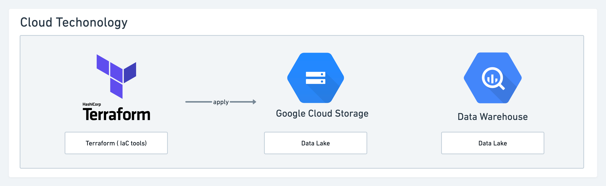
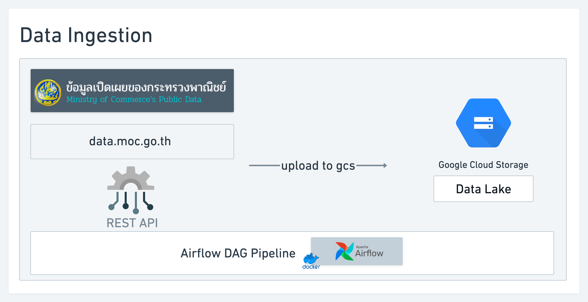
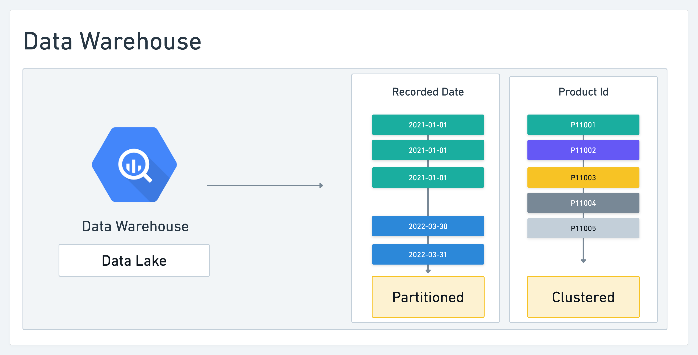
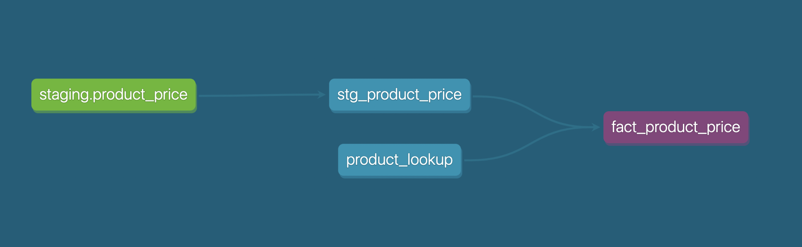
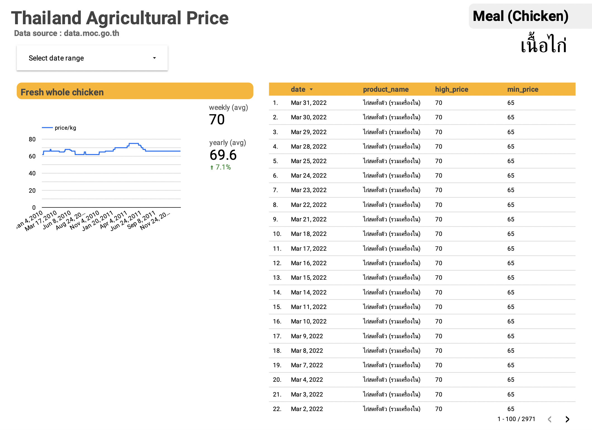

# Problem Description

Project Description:

- This year, inflation has affected the prices of goods and services in many countries. same as Thailand.
- Due to personal interest and is one of the people affected by the problem. Makes me want to know how the price of each type of product has changed But found that most of the information in Thailand is not in a format that can be tracked and is easily accessible to the general public.

What the problem the project solves ?

- Data Warehouse of product prices in Thailand for use in data analysis, dashboard, APIs, etc.
- A dashboard for easy access and monitoring of product prices.
- A public dashboard that can easily monitor and interpret a data visualization.

# Cloud

- Infrastructure as code (Iac Tools)

  - Terraform

- Data Lake

  - Google Cloud Storage

- Data Warehouse

  - Big Query

# Data ingestion

- Step
  - Get data product price from from data.mog.co.th (Ministry of Comerce's Public Data)
  - Load source data to data lake (GCS)
  - Daily update data by Apache Airflow
- Pipeline

  - Use Apache Airflow for data pipeline.

- Seeds Datasets
  - Data from 2010 - 2021 will use seeding data concept.
  - Product Price data will start daily update from 2022.

# Data warehouse

- Use Google Big Query for Data Warehouse

# Transformations (dbt)

- Use dbt cloud for transform data
  

# Dashboard

[Thailand Agricultural Price Dashboard](https://datastudio.google.com/u/0/reporting/1e579ab7-1b66-45ed-bd94-d37b2179da04/page/2TbpC/edit)

# References

- [data-engineering-zoomcamp repository](https://github.com/DataTalksClub/data-engineering-zoomcamp)
- [Running Airflow in Docker](https://airflow.apache.org/docs/apache-airflow/stable/start/docker.html)
